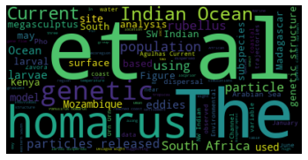
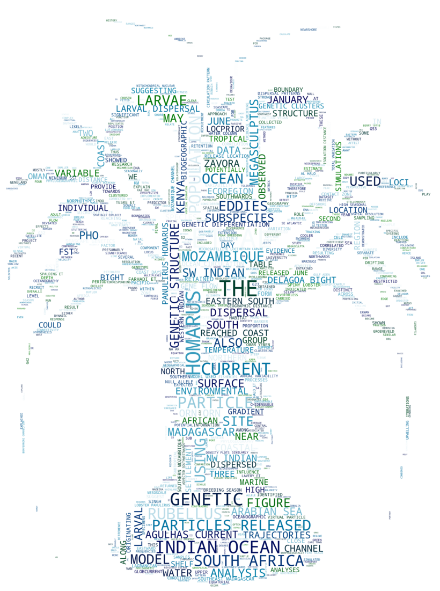

# Creating a Word Cloud from an Academic Paper!

#### Word clouds are a fun and creative way to show what the most used words are in a book, document, website or basically anything containing words. I wanted to create a word cloud from one of my papers that were published from my PhD. To take it a step further, I wanted to turn it into a lobster cloud because the paper is on a species of spiny lobster. Here is a walkthrough of how I did this...

#### First, let's see what we will need to import. Academic papers are usually in a column format, so I used the [pdf_layout_scanner](https://pypi.org/project/PDF-Layout-Scanner/) package by Yusuke Shinyama to import the pdf into a format that can be read by the computer. It extracts text from pdf's with multiple columns.


```python
from pdf_layout_scanner import layout_scanner
```

#### Next, we import the [Natural Language Toolkit](https://www.nltk.org/) or nltk library, which we will use to tokenize words from the pdf. We will also remove stop words which are commonly used words such as 'the', 'a', 'in' etc.


```python
from nltk import word_tokenize
from nltk.corpus import stopwords
```

#### Then we want to import the [WordCloud](http://amueller.github.io/word_cloud/) library.


```python
from wordcloud import WordCloud
```

#### Another important library we will need is the [Pillow (PIL)](https://python-pillow.org/). Pillow is used for opening, manipulating and saving different image file formats  


```python
from PIL import Image
```

#### Finally, we will import numpy, pandas and matplotlib


```python
import numpy as np
import pandas as pd
import matplotlib.pyplot as plt
```

#### Step 1: Parse the pdf file using layout_scanner


```python
pages = layout_scanner.get_pages('lobster.pdf')
```

    2020-06-22 13:19:21 pdf_layout_scanner.layout_scanner[INFO] Manually Merged y1: 444.19 -> 478.63
    2020-06-22 13:19:21 pdf_layout_scanner.layout_scanner[INFO] Manually Merged y1: 444.19 -> 478.63
    2020-06-22 13:19:21 pdf_layout_scanner.layout_scanner[INFO] Manually Merged y1: 444.19 -> 478.63
    2020-06-22 13:19:21 pdf_layout_scanner.layout_scanner[INFO] Manually Merged y1: 444.19 -> 478.63
    2020-06-22 13:19:21 pdf_layout_scanner.layout_scanner[INFO] Manually Merged y1: 444.19 -> 478.63
    2020-06-22 13:19:21 pdf_layout_scanner.layout_scanner[INFO] Manually Merged y1: 444.19 -> 478.63
    2020-06-22 13:19:27 pdf_layout_scanner.layout_scanner[INFO] Manually Merged y1: 187.46 -> 486.07
    2020-06-22 13:19:33 pdf_layout_scanner.layout_scanner[WARNING] candidates has shape (2, 7)
    2020-06-22 13:19:33 pdf_layout_scanner.layout_scanner[INFO] Manually Merged y1: 177.68 -> 214.28
    2020-06-22 13:19:33 pdf_layout_scanner.layout_scanner[INFO] Manually Merged y1: 177.68 -> 214.28
    2020-06-22 13:19:34 pdf_layout_scanner.layout_scanner[WARNING] candidates has shape (16, 7)
    2020-06-22 13:19:34 pdf_layout_scanner.layout_scanner[INFO] Manually Merged y1: 688.09 -> 703.57
    2020-06-22 13:19:34 pdf_layout_scanner.layout_scanner[WARNING] candidates has shape (15, 7)
    2020-06-22 13:19:34 pdf_layout_scanner.layout_scanner[INFO] Manually Merged y1: 673.09 -> 688.09
    2020-06-22 13:19:34 pdf_layout_scanner.layout_scanner[WARNING] candidates has shape (14, 7)
    2020-06-22 13:19:34 pdf_layout_scanner.layout_scanner[INFO] Manually Merged y1: 658.09 -> 673.09
    2020-06-22 13:19:34 pdf_layout_scanner.layout_scanner[WARNING] candidates has shape (13, 7)
    2020-06-22 13:19:34 pdf_layout_scanner.layout_scanner[INFO] Manually Merged y1: 643.09 -> 658.09
    2020-06-22 13:19:34 pdf_layout_scanner.layout_scanner[WARNING] candidates has shape (12, 7)
    2020-06-22 13:19:34 pdf_layout_scanner.layout_scanner[INFO] Manually Merged y1: 628.09 -> 643.09
    2020-06-22 13:19:34 pdf_layout_scanner.layout_scanner[WARNING] candidates has shape (11, 7)
    2020-06-22 13:19:34 pdf_layout_scanner.layout_scanner[INFO] Manually Merged y1: 613.09 -> 628.09
    2020-06-22 13:19:34 pdf_layout_scanner.layout_scanner[WARNING] candidates has shape (10, 7)
    2020-06-22 13:19:34 pdf_layout_scanner.layout_scanner[INFO] Manually Merged y1: 598.09 -> 613.09
    2020-06-22 13:19:34 pdf_layout_scanner.layout_scanner[WARNING] candidates has shape (9, 7)
    2020-06-22 13:19:34 pdf_layout_scanner.layout_scanner[INFO] Manually Merged y1: 583.09 -> 598.09
    2020-06-22 13:19:34 pdf_layout_scanner.layout_scanner[WARNING] candidates has shape (8, 7)
    2020-06-22 13:19:34 pdf_layout_scanner.layout_scanner[INFO] Manually Merged y1: 568.0600000000001 -> 583.09
    2020-06-22 13:19:34 pdf_layout_scanner.layout_scanner[WARNING] candidates has shape (7, 7)
    2020-06-22 13:19:34 pdf_layout_scanner.layout_scanner[INFO] Manually Merged y1: 553.0600000000001 -> 568.0600000000001
    2020-06-22 13:19:34 pdf_layout_scanner.layout_scanner[WARNING] candidates has shape (6, 7)
    2020-06-22 13:19:34 pdf_layout_scanner.layout_scanner[INFO] Manually Merged y1: 538.0600000000001 -> 553.0600000000001
    2020-06-22 13:19:34 pdf_layout_scanner.layout_scanner[WARNING] candidates has shape (5, 7)
    2020-06-22 13:19:34 pdf_layout_scanner.layout_scanner[INFO] Manually Merged y1: 523.0600000000001 -> 538.0600000000001
    2020-06-22 13:19:34 pdf_layout_scanner.layout_scanner[WARNING] candidates has shape (4, 7)
    2020-06-22 13:19:34 pdf_layout_scanner.layout_scanner[INFO] Manually Merged y1: 508.06 -> 523.0600000000001
    2020-06-22 13:19:34 pdf_layout_scanner.layout_scanner[WARNING] candidates has shape (3, 7)
    2020-06-22 13:19:34 pdf_layout_scanner.layout_scanner[INFO] Manually Merged y1: 493.06 -> 508.06
    2020-06-22 13:19:34 pdf_layout_scanner.layout_scanner[WARNING] candidates has shape (2, 7)
    2020-06-22 13:19:34 pdf_layout_scanner.layout_scanner[INFO] Manually Merged y1: 478.06 -> 493.06
    2020-06-22 13:19:34 pdf_layout_scanner.layout_scanner[INFO] Manually Merged y1: 463.06 -> 478.06
    2020-06-22 13:19:34 pdf_layout_scanner.layout_scanner[INFO] Manually Merged y1: 463.06 -> 703.57
    2020-06-22 13:19:35 pdf_layout_scanner.layout_scanner[WARNING] candidates has shape (16, 7)
    2020-06-22 13:19:35 pdf_layout_scanner.layout_scanner[INFO] Manually Merged y1: 688.09 -> 703.57
    2020-06-22 13:19:35 pdf_layout_scanner.layout_scanner[WARNING] candidates has shape (15, 7)
    2020-06-22 13:19:35 pdf_layout_scanner.layout_scanner[INFO] Manually Merged y1: 673.09 -> 688.09
    2020-06-22 13:19:35 pdf_layout_scanner.layout_scanner[WARNING] candidates has shape (14, 7)
    2020-06-22 13:19:35 pdf_layout_scanner.layout_scanner[INFO] Manually Merged y1: 658.09 -> 673.09
    2020-06-22 13:19:35 pdf_layout_scanner.layout_scanner[WARNING] candidates has shape (13, 7)
    2020-06-22 13:19:35 pdf_layout_scanner.layout_scanner[INFO] Manually Merged y1: 643.09 -> 658.09
    2020-06-22 13:19:35 pdf_layout_scanner.layout_scanner[WARNING] candidates has shape (12, 7)
    2020-06-22 13:19:35 pdf_layout_scanner.layout_scanner[INFO] Manually Merged y1: 628.09 -> 643.09
    2020-06-22 13:19:35 pdf_layout_scanner.layout_scanner[WARNING] candidates has shape (11, 7)
    2020-06-22 13:19:35 pdf_layout_scanner.layout_scanner[INFO] Manually Merged y1: 613.09 -> 628.09
    2020-06-22 13:19:35 pdf_layout_scanner.layout_scanner[WARNING] candidates has shape (10, 7)
    2020-06-22 13:19:35 pdf_layout_scanner.layout_scanner[INFO] Manually Merged y1: 598.09 -> 613.09
    2020-06-22 13:19:35 pdf_layout_scanner.layout_scanner[WARNING] candidates has shape (9, 7)
    2020-06-22 13:19:35 pdf_layout_scanner.layout_scanner[INFO] Manually Merged y1: 583.09 -> 598.09
    2020-06-22 13:19:35 pdf_layout_scanner.layout_scanner[WARNING] candidates has shape (8, 7)
    2020-06-22 13:19:35 pdf_layout_scanner.layout_scanner[INFO] Manually Merged y1: 568.0600000000001 -> 583.09
    2020-06-22 13:19:35 pdf_layout_scanner.layout_scanner[WARNING] candidates has shape (7, 7)
    2020-06-22 13:19:35 pdf_layout_scanner.layout_scanner[INFO] Manually Merged y1: 553.0600000000001 -> 568.0600000000001
    2020-06-22 13:19:35 pdf_layout_scanner.layout_scanner[WARNING] candidates has shape (6, 7)
    2020-06-22 13:19:35 pdf_layout_scanner.layout_scanner[INFO] Manually Merged y1: 538.0600000000001 -> 553.0600000000001
    2020-06-22 13:19:35 pdf_layout_scanner.layout_scanner[WARNING] candidates has shape (5, 7)
    2020-06-22 13:19:35 pdf_layout_scanner.layout_scanner[INFO] Manually Merged y1: 523.0600000000001 -> 538.0600000000001
    2020-06-22 13:19:35 pdf_layout_scanner.layout_scanner[WARNING] candidates has shape (4, 7)
    2020-06-22 13:19:35 pdf_layout_scanner.layout_scanner[INFO] Manually Merged y1: 508.06 -> 523.0600000000001
    2020-06-22 13:19:35 pdf_layout_scanner.layout_scanner[WARNING] candidates has shape (3, 7)
    2020-06-22 13:19:35 pdf_layout_scanner.layout_scanner[INFO] Manually Merged y1: 493.06 -> 508.06
    2020-06-22 13:19:35 pdf_layout_scanner.layout_scanner[WARNING] candidates has shape (2, 7)
    2020-06-22 13:19:35 pdf_layout_scanner.layout_scanner[INFO] Manually Merged y1: 478.06 -> 493.06
    2020-06-22 13:19:35 pdf_layout_scanner.layout_scanner[INFO] Manually Merged y1: 463.06 -> 478.06
    2020-06-22 13:19:35 pdf_layout_scanner.layout_scanner[INFO] Manually Merged y1: 313.01 -> 353.33
    2020-06-22 13:19:35 pdf_layout_scanner.layout_scanner[INFO] Manually Merged y1: 94.104 -> 119.54
    2020-06-22 13:19:35 pdf_layout_scanner.layout_scanner[INFO] Manually Merged y1: 119.54 -> 273.65
    2020-06-22 13:19:36 pdf_layout_scanner.layout_scanner[ERROR] failed to save image on page39 <LTImage(Image116) 72.000,442.830,479.480,744.480 (607, 449)>
    2020-06-22 13:19:37 pdf_layout_scanner.layout_scanner[ERROR] failed to save image on page40 <LTImage(Image119) 72.000,392.180,523.280,744.480 (1500, 1171)>
    2020-06-22 13:19:38 pdf_layout_scanner.layout_scanner[ERROR] failed to save image on page41 <LTImage(Image122) 72.000,342.470,523.260,769.920 (1380, 1307)>
    2020-06-22 13:19:38 pdf_layout_scanner.layout_scanner[ERROR] failed to save image on page42 <LTImage(Image125) 72.000,398.380,523.290,744.480 (1064, 816)>
    2020-06-22 13:19:38 pdf_layout_scanner.layout_scanner[ERROR] failed to save image on page43 <LTImage(Image128) 72.000,353.920,523.300,769.920 (1380, 1272)>
    2020-06-22 13:19:39 pdf_layout_scanner.layout_scanner[ERROR] failed to save image on page44 <LTImage(Image131) 72.000,189.870,523.300,756.470 (1429, 1794)>
    

#### Check how many pages we working with


```python
print(len(pages))
```

    44
    

#### Created a variable called text to store the first 23 pages of the paper (the rest are references, or images)


```python
text = pages[0:23]
```


```python
type(text)
```


    list


#### Our text is currently a list, which we will have to convert into a string. We have 52251 words


```python
text2 = ' '.join(text) #convert list to string simplest method
```


```python
len(text2)
```


    52251


#### After tokenizing and removing stop words we see that the number of words is now reduced to 6711


```python
stop_words = set(stopwords.words('english'))
text_tokens = word_tokenize(text2)

filtered_words = [w for w in text_tokens if not w in stop_words]
len(filtered_words)

```


    6711


```python
filtered_words = ' '.join(filtered_words)
```

#### Now for the fun part! To make the wordcloud in the shape of a lobster, we will need a vector .png image of a lobster. The best resource for finding pictures of biological creatures is [PhyloPic](http://phylopic.org/). Download the image to your working folder and assign it to a variable.


```python
LOB_FILE = 'Spiny2.png'
```

#### Here is an example of how an ordinary word cloud looks


```python
word_cloud = WordCloud().generate(filtered_words)

plt.imshow(word_cloud, interpolation = 'bilinear')
plt.axis('off')
plt.show()
```





#### Now we will use pillow to read the image and do some manipulations. We have to create an image mask from the lobster image which will be a canvas for the wordcloud


```python
icon = Image.open(LOB_FILE)
#creating blank image object using pillow
image_mask = Image.new(mode='RGB', size = icon.size, color = (255, 255, 255))
image_mask.paste(icon, box = icon)
rgb_array = np.array(image_mask) #converts the image object into an array


word_cloud = WordCloud(mask = rgb_array, background_color = 'white',
                      max_words = 1000, colormap = 'ocean', max_font_size = 300)
word_cloud.generate(filtered_words.upper())

plt.figure(figsize=[20, 20])
plt.imshow(word_cloud, interpolation = 'bilinear')
plt.axis('off')
plt.show()
```





#### And there you have it! A beautiful lobster wordcloud created from an academic paper
