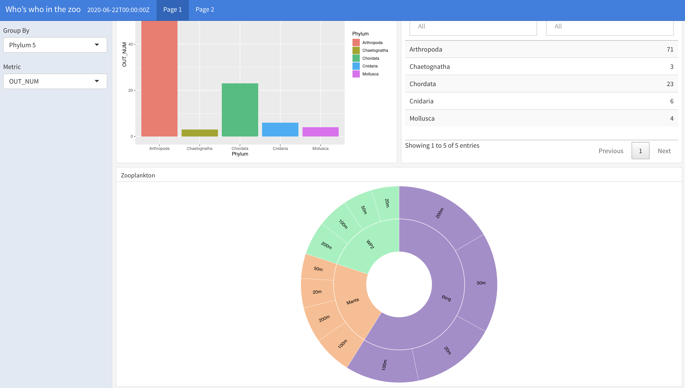

This dashboard showcases the species sequenced using DNA metabarcoding, from Aliwal Shoals and Durban in the Indian Ocean in South Africa. The interactive sunburst diagram allows you to see species assemblages at different depths (20m, 50m, 100m and 200m) and with the different net types used (ring, manta or wp2). You can then drill down from Phylum to Species! [See it here in the shiny webapp](https://sohana-singh.shinyapps.io/zooplankton/)
